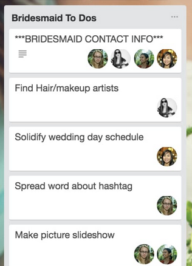

# Licytacja

Aktynwa wersja trello

gdzie można opisywac zdarzenia
automatyzowac
co jak sie pojawi akcja

akcje wziac z api trello

+ CRUD
    + Board/Space/Env/Day
    + Column/Projekt
    + Card/Ticket

+ People Action
    + move
    + change 
    + add me to Ticket
    
w kazdym ticketie jest chat z robotem, serverem lub osoba
    
    
Szablony Realizacji projektu
https://trello.com/teams/wedding-planning

http://community.uservoice.com/blog/trello-google-docs-product-management/

[How We Use Trello & Google Docs to Make UserVoice Better Every Day | UserVoice Blog | UserVoice Blog](http://community.uservoice.com/blog/trello-google-docs-product-management/)

> _Editor’s Note: Need help building an awesome product roadmap? Don’t forget to check out [Get Your Priorities Straight! The Product Manager’s Guide to Smart Product Roadmap Prioritization](http://www6.uservoice.com/l/17202/2015-06-24/27dkx3), our free eBook geared towards product managers facing some tough decisions as they map out the next leg of their product’s journey on their product roadmap._
> 
> _Get the full version for detailed advice on how to prioritize your product roadmap!_
> 
> * * *
> 
> Last fall I returned from vacation to find that [UserVoice](http://www.uservoice.com)‘s Product Manager, Dejana, had replaced my precious Google Doc “Roadmap” with a [Trello](http://trello.com) board.
> 
> It should be noted that my initial reaction to this new process was not positive. My issues weren’t really with Trello but rather how we were using it. Trello is a VERY open ended product. Trello, purposefully, doesn’t prescribe a “right” way to use it so it requires you to get inside and move the furniture around a bit to get it feeling like home.
> 
> However after much experimentation, I think we’ve finally arrived at a process we’re very happy with and I thought we should share how it works and what we’ve learned along the way. This will be a longer post than usual and, if you’re not into the process of delivering web products, probably a bit dry. If you prefer to skip directly to our [lessons learned](http://community.uservoice.com/blog/trello-google-docs-product-management/#lessonslearned), I’ll be sad but not offended.
> 
> ### Our Process
> 
> Our development process spans 6 different Trello boards. The focal point of all of these boards is the Current Development board. The goal of all the other boards is to feed cards (representing either an enhancement or a bug, more on these in a minute) into the Current Development board and specifically into its Next Up column. The Next Up column is THE single prioritized list that all of the product team (developers & designers) looks at when they’re ready to take a new card to work on.
> 
> 
> 
> Before we dive into the role of all these different boards let’s talk about the blood cells in our product development circulatory system: Trello cards.
> 
> ##### \[cta id=’2003897′\]
> 
> ### Cards
> 
> 
> 
> A card represents a single story to be implemented. It could be a new enhancement, a refactoring task or a bug.
> 
> Enhancement cards start out as a simple idea, 1-2 sentences long. But before they can move in development they’ll be expanded to include a link to a full-blown Google Doc “spec” and a set of wireframes or (rough) mock ups.
> 
> We use the term spec fairly loosely here. These aren’t the specs you remember from your college project course or that crappy enterprise IT consulting company you worked for right out of college. The spec explains the high level customer story, why (from a business perspective) we’re addressing this, what we hope to achieve, and maybe some notes on suggested implementation (though engineers may take or leave this section at their discretion; it’s supposed to be helpful not prescriptive). A good spec will also include first-hand customer stories and a link to the related idea on our UserVoice forums.
> 
> If the card is a bug then it simply has steps to reproduce the bug (which hopefully includes a screencast) and a link to the [UserVoice Helpdesk](http://www.uservoice.com/helpdesk) ticket that originated it.
> 
> 
> 
> ### How the sausage is made
> 
> 
> 
> The Current Development board is the “where the magic happens” board. It has the following columns:
> 
> -   **Next Up**
>     -   Prioritized list of all cards vetted and ready for design & development.
>     -   It’s worth noting that as a engineer or designer you’re not required to take the top card off the stack but rather the top card you feel most apt to handle.
> -   **In Progress**
>     -   These are the cards that are under active design or development.
>     -   Once you take a card you “put your face on it” (assign it to yourself). Dev etiquette is that you should never have your face on more than 2 cards at a time: 1 major project and 1 minor.
>     -   When an engineer takes a card they assign a due date on it to let others know the “expected” delivery date of this card to QA. A quick scan of our board tells me that this rule is more aspirational than executed upon. 
> -   **QA**
>     -   When the engineer thinks they’ve completed the story, they’ll deploy it to staging (or sometimes to production but hide the feature behind a “feature flag”) and drag the card to QA.  At this point it our QA manager and Head of UX are responsible for taking a look and verifying that everything looks okay for this to go live.
>     -   As mentioned previously, If the card is an enhancement project that’s quite large we’ll spin up a whole new board dedicated to issues that came up during QA of that project. The project card will stay in QA until all the cards on the project specific QA board are done.
> -   **Launchpad**
>     -   These cards have been reviewed by QA and are ready to be deployed (but not necessarily launched, but more on that in a minute) and there’s probably a GitHub Pull Request associated with it (which will be merged into master by the person that opened the pull request. It’s worth noting that there is no central chokepoint for merging into master: everyone can do it).
>     -   If the card is a bug or refactoring task it will be deployed to production immediately (but not after 3p PST unless you, as the deployer, are willing to be around for the next 90 minutes to monitor any issues that come up).
>     -   If the card is an enhancement then it will be deployed to production but will be hidden from end-users by a “feature flag”. Feature flags are named conditional bits that can be turned on, on a per-account basis, to grant access to the new feature. We’ll immediately turn it on for our own UserVoice account and any customers selected by the customer team for early access but otherwise it falls to Marketing to turn on for all accounts when it’s officially launched.
> -   **Live (Week #)**
>     -   These cards have been deployed and are no longer hidden behind feature flags.
>     -   The only people who move cards to “Live” (essentially our Completed list) are the Product Manager (for enhancements) and the Bug Reporter (for bugs). This helps ensure that the feedback loop is completed before cards move out of sight.
>     -   Each week has it’s own Live column so we can track what got launched when.
> 
> In addition we use 3 labels that can be applied to a card:
> 
> -   **Bug**
> -   **Staging – Deployed to staging**
> -   **Production – Deployed to production**
> 
> That was easy right? It’s very much a Kanban style approach to development. Now let’s dive into how cards get onto this board in the first place.
> 
> ### Mommy, where do cards come from?
> 
> New cards can come from one of 4 different boards:
> 
> -   **Product Roadmap**
>     -   This has all the major projects for each quarter looking roughly 3 quarters ahead. These big projects are moved to the Planning board once that quarter begins.
> 
> -   **Inbox**
>     -   There are two columns on here: one for ideas from anyone in the company and another for customer ideas (related to [UserVoice Helpdesk](http://www.uservoice.com/helpdesk) support tickets or ideas submitted to our [UserVoice customer feedback forums](http://www.uservoice.com/feedback)).
>     -   The ideas on this board are reviewed once a week during our Inbox Review meeting (see below for more details).
> -   **Bugs**
>     -   There are 3 columns here:
>         -   Inbox – unvetted reported bugs.
>         -   Needs input – We’ve had issues reproducing the issue and the original reporter needs to provide more info.
>         -   Accepted – Yes, this is almost most certainly a bug.
>     -   If a bug moves to Accepted and is considered “Critical” by the customer team (you can see how we decide that by reading our [critical issue escalation process](http://www.uservoice.com/blog/entries/off-hours-critical-issue-escalation-process/)) then it moves immediately to the Current Development board and the “dev on call” is alerted.
>     -   If the bug is not critical it stays in Accepted until the Head of Customer Service moves it into the Next Week column which is the bugs that will be fixed next week (duh). The caveat is that he’s only allowed to pick 7 bugs per week. Why only 7 you ask? Because there are always bugs and the customer team always wants them all fixed but one of our major learnings was to set a constant throttle of how much time we’d devote to (non-critical) bug fixing.
> -   **Engineering**
>     -   We keep a list of areas that we think might need refactoring.  Each list is a category (eg, Backend, Frontend, Tests, Infrastructure), and each card is a refactoring project or other non-customer-facing project.
>     -   Engineers take small cards when they feel like it and add them to in progress; larger cards need to be planned in the Next Up list
> 
> ### Who said central planning doesn’t work? (Planning board)
> 
> 
> 
> The Planning board is where myself, our PM, and head of UX spend the majority of our time. It has the following columns:
> 
> -   **Next Up**
>     -   This is our roughly prioritized list of the next projects we want to spec out for development
> -   **Spec**
>     -   This means “someone needs to write a spec”. The card at this point is usually just a rough idea.
>     -   We use Google Docs for specs and heavily rely on contextual comments to asynchronously discuss any contentious points with other members of the team. Any sufficiently complex contentious concept will be fleshed out in an impromptu design meeting (more on this in next section).
> -   **Design**
>     -   Means that the card needs a designer to take a look at it, duh. This doesn’t necessarily mean that a wireframe or mockup will be made as the design stage isn’t just about the look of it, but very much about taking the spec requirements and ironing out design concepts, usability, workflows, and impact on existing functionality – essentially vetting it and hammering out any show-stopping kinks before it goes into the dev cycle. (Also, if the spec needs to go back to the drawing board, it’s sent back to the Spec list.)
> -   **Ready**
>     -   We have spec that’s been reviewed by the idea creator and by the design team. We optionally have a wireframe or other needed artifacts. This is ready to be moved to the Next Up column on Current Development (after it’s reviewed at the Product Planning meeting).
> 
> On every other board cards move almost exclusively only from left to right but not on the Planning board. It’s not uncommon for a card to go from Design or Ready back to Spec one or more times before it’s finally moved to Current Development.
